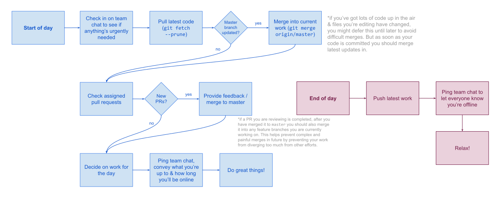

# Contributor workflow

> (or: How to manage parallel contributions harmoniously in highly asynchronous distributed teams?)

<!-- MarkdownTOC -->

- [External contributors and pull requests](#external-contributors-and-pull-requests)
- [Team workflow & coordination protocol](#team-workflow--coordination-protocol)
	- [Tracking tasks](#tracking-tasks)
	- [Picking up new work](#picking-up-new-work)
	- [Completing finished work](#completing-finished-work)
	- [Release management](#release-management)
- [Git conventions](#git-conventions)
	- [Best practises](#best-practises)
	- [Branching workflow](#branching-workflow)
- [Code quality and standards](#code-quality-and-standards)

<!-- /MarkdownTOC -->

## External contributors and pull requests

All external contributions in the form of PRs are welcomed. If there are existing issues within hREA that you plan to work on, please comment on the relevant issue thread asking to be assigned.

In the way that internal contributors use Github you should be able to have confidence that any unassigned issue is ready to be taken on by anyone who wishes to do so.

If you are unsalaried or experiencing financial hardship, please consider becoming part of the hREA team and see [[Financial support for contributions]].

## Team workflow & coordination protocol

[Joining the hREA team](https://github.com/h-REA/ecosystem/wiki/How-to-contribute-to-the-hREA-project) basically means being added to the Github org so that issues can be assigned to you and you can publish your work as feature branches within the main repository. Joining the team also presumes you adhere to our workflows and processes.

We try to keep process overhead to a minimum when managing hREA's development. We all quit our day jobs to do this, after all. Nevertheless, some formality is necessary to keep things streamlined as we move together and ensure that everybody's work can be smoothly combined.

Our daily workflow looks like this:

If you would like to improve these processes, we love you! Please [file an issue](https://github.com/h-REA/ecosystem/issues/new) and tell us your thoughts.

### Tracking tasks

- All work is logged as standard Github issues. We mostly use the labels `enhancement`, `bug`, `question`, `decision` & `user story`.
- Issues are grouped into Github milestones. Milestones describe major features and have no particular ordering or relationship to each other, unless otherwise indicated in their descriptions.

### Picking up new work

- **Assigning oneself to an issue indicates a commitment to completing the task.** Before picking up an issue with an existing assignee, one should check with the other person(s) for a handover.
- Before beginning a task, one should coordinate with other developers who may depend on the outcome. Contributors should follow a [design by contract](https://en.wikipedia.org/wiki/Design_by_contract) approach and decide on interfaces for common code together before proceeding with implementation. This conversation is best had in the Github issue thread.
- If working within the `hREA` codebase, branches should be named in the format `feature/XX-some-issue` where `XX` is the Github issue ID of the primary task related to the work. If working in one's own fork of the repository any branch names are fine, but it is recommended to provide links to your private branch in the issue comments thread so that others may follow along.

### Completing finished work

- All new contributions must come with full test coverage to prove that the requested features are provided. **No pull requests should be submitted without including tests.**
- Completed work should be submitted as a Github pull request. Another project contributor must approve all pull requests in addition to the author.
    - *(In the event that only a single contributor is maintaining the project, one may merge their own pull requests **provided** that full test coverage is also included.)*
- Once PRs have been approved they are merged to `master` and the feature branch is deleted.

### Release management

- A `release/` branch is opened to commit updates to package version numbers, README files and any other release prep work (eg. building documentation)
- Once ready, `release/` is merged to `master`.
- The resultant commit is tagged using semver with no prefix, eg. `0.13.2`.

## Git conventions

### Best practises

- Commit messages should take the imperative form; ie. finish the sentence *"Applying this commit will [...]"*
- Use descriptive, single-line commit messages
- Make commits as atomic as possible. This makes life easier for a [variety of reasons](https://brainlessdeveloper.com/2018/02/19/git-best-practices-atomic-commits/). Heavily consider using `git add -p`, and *never* use `git add -A`.

### Branching workflow

We use a [gitflow](https://danielkummer.github.io/git-flow-cheatsheet/)-inspired but slightly less onerous process:

- We work off `master` and consider it our stable integration branch
- All work on improving the systems occurs in branches prefixed with `feature/XX-`, where `XX` is the related Github issue number
    - Feature branches are merged back to `master` *only* when fully integrated and tested
    - It is expected that developers working on new features merge in updates from `master` as work unfolds in order to minimise merge conflicts later
    - It is fine to merge work from another feature branch into your own in the case of interdependent features which cannot be completed without integrating
- Miscellaneous patches which don't fall under the usual improvement workflow can be undertaken in `hotfix/XX-` branches and merged back to master when tested and ready for deployment
- When finishing up work in any branch, it should be deleted and removed from Github.

## Code quality and standards

For a description of the Rust documentation comment conventions, see [this manual section](https://doc.rust-lang.org/book/ch14-02-publishing-to-crates-io.html#commonly-used-sections).

All JavaScript and TypeScript code should pass eslint tests and adhere to [correct formatting](README.md#editorconfig).

All code must be fully tested before merging to `master`.
